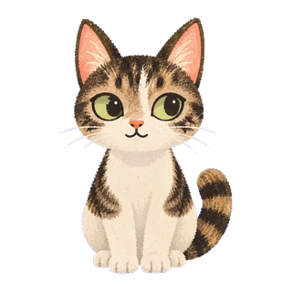
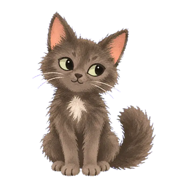
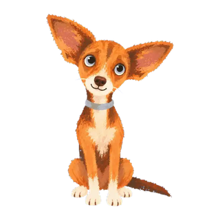

# Мои питомцы

Уютная игра про трёх питомцев — кошку Лею, кота Варяга и собаку Джорджию.
Открывается по ссылке в браузере телефона, ставить ничего не нужно.

<p align="center">
  
  
  
</p>

## Что внутри

**Главная.** Питомец живёт во дворе своей нарисованной анимацией: моргает,
дышит, поводит ушами. Соседей можно перелистывать наклейками по краям.
Периодически появляются баблы — похвала, шутки, факты, с правильным родом
для каждого. Кнопка «Еда» открывает шторку с угощениями, «Играть» кладёт
игрушку на экран: её водят прямо по питомцу, и только эти секунды идут в счёт.

**Записка.** Конверт сверху подрагивает, пока его не откроют. Внутри — одно
пожелание на день, всего их 365. Новое приходит в полночь.

**Пазлы.** Картинка режется на равные квадраты, кусочки лежат внизу
вперемешку и встают на место только каждый в свой. Превью серое, пока не
соберёшь; собранную можно сохранить на устройство и собрать заново — кусочки
перемешаются по-новому.

## Как запустить

```bash
npm install
npx expo start --web
```

Открыть `http://localhost:8081`. Для телефона — тот же адрес в локальной сети
или `npx expo start --tunnel`.

## Стек

Expo SDK 57, React Native, TypeScript, Expo Router, Zustand с сохранением в
AsyncStorage, Reanimated и Gesture Handler для анимаций и перетаскивания.

Анимации питомцев — видео, у которых убран хромакей и которые нарезаны в
бесшовные циклы: первый и последний кадр совпадают, поэтому переход между
покоем и игрой ждёт конца цикла и проходит незаметно.

Исходные видео и картинки лежат в `image/` и в репозиторий не входят —
в `assets/` уже готовые спрайты.
